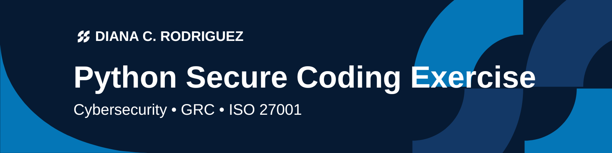

# 🧠 Python Secure [Topic] Exercise

This project demonstrates secure coding practices in Python, focusing on [topic].  
It was developed as part of academic exercises and adapted to align with cybersecurity and GRC professional standards.

## 🔐 Security-Oriented Features
- Input validation and error handling
- Safe data manipulation
- Modular and reusable code design
- Defensive programming principles

## 🧠 Technologies
- Python 3.x
- Control structures (`if`, `for`, `while`)
- Functions and exception handling

## 🛡️ Compliance Alignment (ISO 27001 & DORA)

This repository demonstrates secure coding principles aligned with international and regulatory frameworks:

### 🔹 ISO 27001 – Information Security Management System (ISMS)
- **Control A.12.6.1 – Technical Vulnerability Management:** Input validation and error handling prevent exploitation of insecure code.
- **Control A.14.2.5 – Secure System Engineering Principles:** Modular and reusable code design supports secure development lifecycle.
- **Control A.14.2.9 – System Acceptance Testing:** Exception handling and validation simulate resilience testing before deployment.

### 🔹 DORA – Digital Operational Resilience Act
- **Article 5–14 – ICT Risk Management:** Demonstrates structured risk mitigation through defensive programming.
- **Article 15–20 – Incident Management:** Exception handling models detection and containment of operational errors.
- **Article 24–27 – Resilience Testing:** Code validation and error simulation reflect proactive resilience assessment.
- **Article 28–44 – Third‑Party Oversight:** Modular architecture enables supplier code review and secure integration.

### 💡 Professional Context
These exercises illustrate how secure coding supports compliance with ISO 27001 and DORA by embedding resilience, validation, and accountability into the software development process.  
They serve as practical examples of how technical controls translate into regulatory compliance for FinTech and GRC environments.

## 👩‍💻 Author
**Diana Carolina Rodriguez Casas**  
Cybersecurity & GRC Professional | ISO 27001 | SOX | AI Security  
Portfolio: [https://dianacrodriguez-stratsec.github.io/carolina-portfolio/](https://dianacrodriguez-stratsec.github.io/carolina-portfolio/)  
LinkedIn: [https://www.linkedin.com/in/diana-carolina-rodriguez-casas](https://www.linkedin.com/in/diana-carolina-rodriguez-casas)
