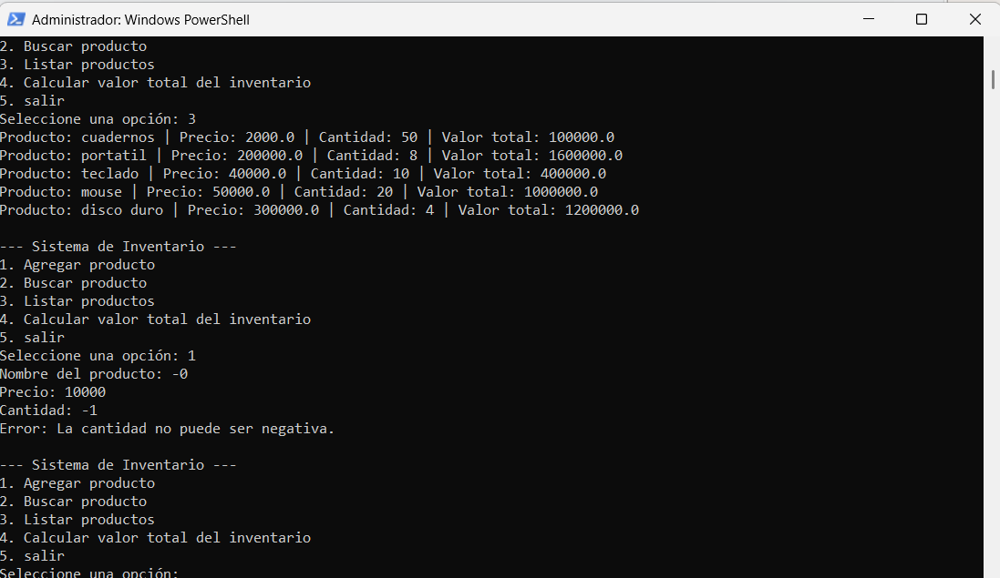

# Secure Inventory System 🛡️

This project demonstrates secure coding practices in Python using Object-Oriented Programming (OOP), input validation, exception handling, and interactive CLI design.

## 🎯 Purpose
Developed as part of UNIR coursework and adapted to showcase DevSecOps and ISMS (ISO 27001 / DORA) principles.

## 🧠 Skills Demonstrated
- Secure input validation (prevents negative values, empty names)
- Exception handling and resilience
- Object-Oriented Programming (Producto, Inventario)
- CLI automation
- Secure data processing aligned with ISO 27001 controls
- DevSecOps mindset for safe scripting

## 📸 Evidence


## 🚀 Professional Context
This project simulates secure data handling similar to:
- ISMS asset management
- DORA ICT risk management
- Secure automation for compliance reporting
- Internal tooling for GRC teams

## ▶️ How to Run
```bash
python sistema_inventario.py
